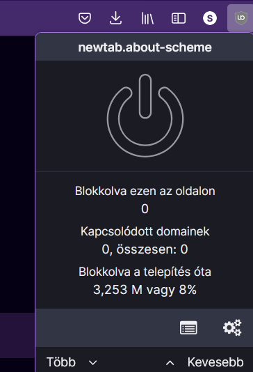
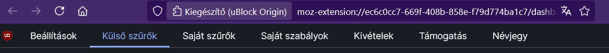
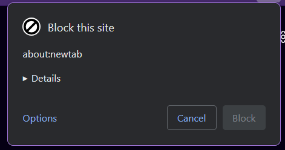
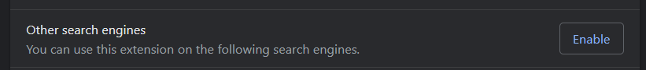
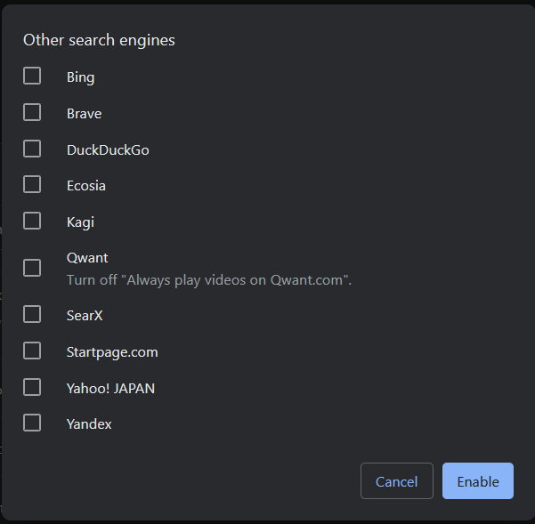
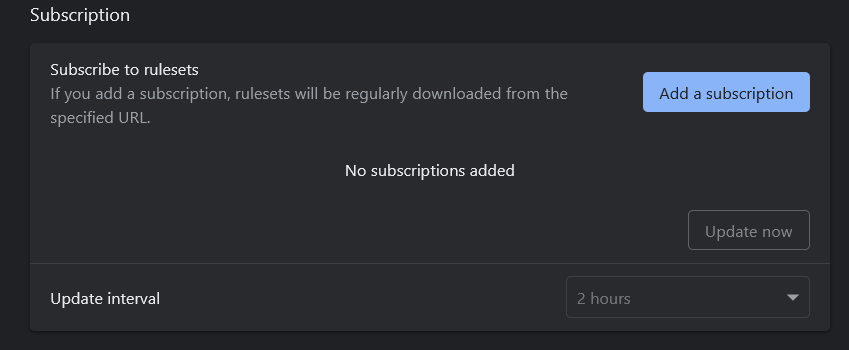
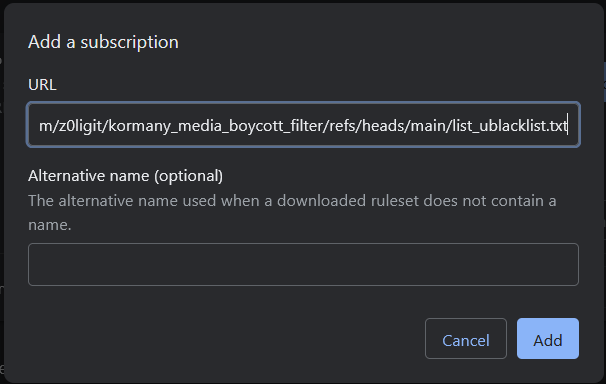

# uBlock Origin Telepítés

Töltsd le az uBlock Origint ha még nincs meg.(Az uBlock Origin Lite nem jó, bocsánat Chrome userek)
> https://ublockorigin.com/

Keresd meg az uBlock ikonját és ott kattints rá a fogaskerék ikonra


Majd a "Külső szűrők" gombra


Az oldal alján található "Importálás" menűben illeszd be ezt a linket:
```
https://raw.githubusercontent.com/z0ligit/kormany_media_boycott_filter/refs/heads/main/list.txt
```

# uBlacklist telepítés

Töltsd le az uBlacklistet ha még nincs meg.

> https://iorate.github.io/ublacklist/docs

Keresd meg az uBlacklist ikonját és kattints rá az "Options" gombra


Opcionális: Ha nem a Google keresőt használod akkor itt külön állítsd be azt



Menj le az oldal aljára a "Subscription" menűpontig


Illeszd be oda ezt a linket:
```
https://raw.githubusercontent.com/z0ligit/kormany_media_boycott_filter/refs/heads/main/list_ublacklist.txt
```
